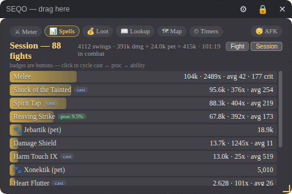
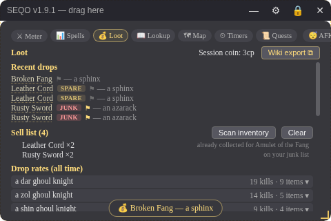
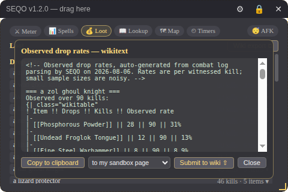
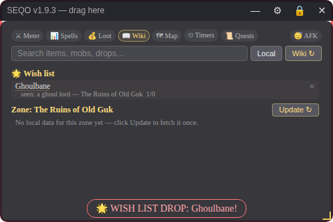
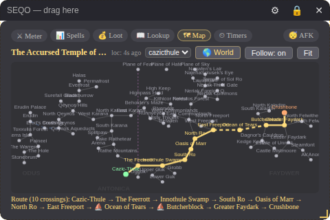
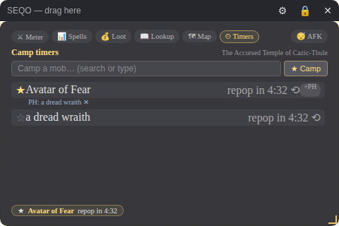
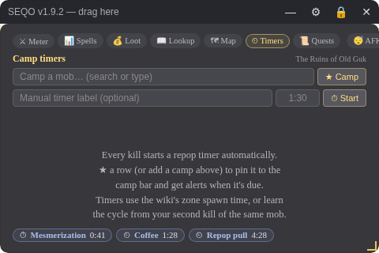
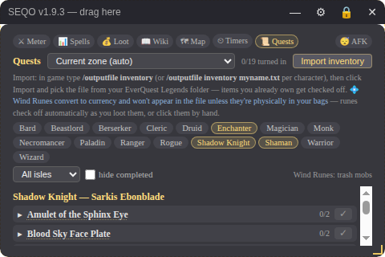

# SEQO — Simple EQ Overlay

**A log-powered companion overlay for EverQuest Legends on Windows 11.**
Live DPS meter · spell & proc analytics · loot tracking with real drop rates · item/zone/quest lookup · maps with live positioning · world travel routing · camp timers with placeholder support · rare-spawn, charm-break, buff-fade & AFK alerts · cross-computer sync.

SEQO never touches the game. It reads the log file EverQuest Legends already writes to disk — the same technique GamParse and nParse used safely for two decades of classic EQ. **No injection, no memory reading, no automation. Nothing for anti-cheat to object to.**



---

## Installation

### For players (recommended)

Grab **`SEQO-Setup-x.y.z.exe`** from the [Releases](../../releases) page and run it — installs per-user (no admin), adds a Start Menu entry, includes an uninstaller. A **portable** exe is also published for the no-install crowd (note: portable unpacks itself each launch, so it starts slower).

> **Windows SmartScreen** will say "Windows protected your PC" the first time, because SEQO isn't code-signed (certificates cost hundreds a year; this is a free fan tool). Click **More info → Run anyway**. The source is right here in this repo if you'd rather audit or build it yourself.

Your data (databases, settings) lives in `%APPDATA%\SEQO` and survives updates and uninstalls.

### From source (tinkerers)

1. Install [Node.js LTS](https://nodejs.org).
2. Download this repository (green **Code** button → Download ZIP) and unzip anywhere, e.g. `C:\SEQO`.
3. In that folder, open a terminal (click the address bar, type `cmd`, Enter) and run:
   ```
   npm install
   npm start
   ```

### Building releases (maintainers)

On Windows, `npm run dist` produces both `SEQO-Setup-x.y.z.exe` (installer) and `SEQO-Portable-x.y.z.exe` in `dist\`. Attach both to a GitHub Release. (Building Windows binaries from Linux requires wine.)

### First-time setup (two minutes)

1. In game, make sure logging is on (`/log`). Your log lives in the game's `Logs` folder as `eqlog_<Name>_<server>.txt`.
2. In SEQO: ⚙ **Settings → Character & Log → Choose…** and pick that file.
3. ⚙ **Settings → Maps → Download all maps ⟳** (one click; ~200 classic zone maps plus EQ Legends fixes).
4. Position the overlay, then press **Ctrl+Alt+O** to lock it and play.

> **Fullscreen note:** overlays can't draw over true exclusive fullscreen. Windows 11's default "fullscreen optimizations" usually makes it work anyway — if SEQO doesn't appear over the game, switch EQ Legends to **borderless/windowed fullscreen** (looks identical).

---

## The overlay itself

| Action | How |
|---|---|
| Move | drag the title bar (edit mode) |
| Resize | drag the gold corner grip — everything inside scales, keeping its ratio |
| Lock (click-through) | **Ctrl+Alt+O**, or the 🔒 button. While locked, clicks pass through to the game |
| Unlock | **Ctrl+Alt+O**, the on-screen **🔓** in the tab strip, or the tray menu |
| Show / hide | **Ctrl+Alt+H**, or single-click the tray icon |
| Minimize | the **—** button; SEQO appears in the taskbar while minimized, and leaves it again on restore |
| Style | opacity, font, size, accent color — ⚙ Settings → Appearance |

**Clicking while locked:** the tab strip and interactive lists stay usable even in click-through mode — controls become clickable the moment your mouse is over them, and everywhere else clicks reach the game. The strip dims while locked so it stays out of your way.

If a hotkey is stolen by another app (Discord and GeForce overlays are the usual suspects), SEQO warns you at launch and the on-screen controls cover everything.

---

## ⚔ Meter

Live per-fight combat stats: your DPS, total damage, max hit, crits, damage taken, and self-healing, plus a damage bar for every combatant — you, your pets, groupmates. Fights are detected automatically; eight quiet seconds ends one, and the meter shows your last fight while idle.

- **Pets count.** Summoned pets are detected from their speech; charmed mobs are recognized instantly from the "has been charmed" landing line (and when they address you as Master). **Pet damage folds into your row** ("Maeel +🐾") and into your stat tiles — that's your real output. Toggle in Settings → Appearance.
- **Silent pet?** Some pets never speak. **Click its row on the meter** to mark it as yours (click again to unmark). Named pets are remembered forever; article-named mobs are treated as your active charm.
- **Damage shields count** ("burned by YOUR flames") and attribute correctly to you, groupmates, or enemies.

## 📊 Spells

Your damage by source — melee, each spell, each proc, damage shield — with totals, counts, averages, and crits.

- **Fight / Session toggle.** Fight shows the current (or last) fight; **Session** aggregates every fight since launch — thousands of swings, which is what makes proc rates statistically real.
- **Proc detection.** Damage from a spell you never cast is flagged as a proc with its rate per melee swing. The log can't distinguish procs from activated abilities, so **every badge is a button**: click to cycle **cast → proc → ability**. Corrections persist forever.
- Pets appear as 🐾 rows in both views; session header shows you + pets = combined.

## 💰 Loot

**▶ Run tracker** (new in 2.1.0): click **Start run** before a personal instance (or any farming session) and SEQO counts every item and every coin split from that moment — a live strip shows duration, coin, item count and coin/hour, updating each second. **End run** freezes the summary (with the item tally) and keeps your recent runs listed below it for comparing clears.

Every kill and every looted item is recorded automatically to a permanent database.

- **Recent drops** as they happen (with an on-screen toast), session coin earned.
- **Drop rates (all time):** click a mob to expand its items — `Fine Steel Rapier: 12/21 (57%)`. Rates are per witnessed kill, recorded **per zone** (the same mob name can drop differently in different zones), and sharpen forever as you play.
- **Difficulty tiers handled correctly:** EQ Legends' D0–D4 tiers (Awakened/Adaptive/Fused/Refined) drop the same items at +N levels, so drop rates **pool across tiers** for maximum sample size — while **mob strength records per tier**, since that's what scales.
- **Items are links** — click any item to open its wiki page in the Data tab.
- **Keep-or-sell verdicts:** the game marks half its drops "quest item," but the ones that matter get a badge on the recent-drops list the moment you loot them — **KEEP** (a Plane of Sky quest of *your* classes needs it, with quest name and progress), **SPARE** (you've already collected one), **SELLABLE** (that quest is turned in), **OTHER CLASS** (only classes you don't play use it). Verdicts come straight from your live quest progress on the Quests tab.
- **⚑ Flag anything yourself:** click the flag next to a drop to cycle *always keep → junk → clear*. Your list is remembered forever, synced between computers, and flagged items announce themselves with a louder toast (⭐ keep / 🗑 junk) whenever they drop — tradeskill mats, epic pieces, known vendor trash. Unknown items stay quiet; click one to search the wiki for quests that mention it.
- **Sell list:** every JUNK, SELLABLE, or SPARE drop adds itself to a running vendor list with counts and reasons (items the game auto-sells at loot are skipped). Destroying an item ("You successfully destroyed…") checks it off the list automatically — coin received from destroyed items counts toward session coin — and you can also click any row to clear it by hand — 💸. **Scan inventory** adds sellables already sitting in your bags (junk-flagged items and pieces of quests you've turned in — held pieces of *open* quests are your collected copies and are never listed). The list persists between sessions and syncs between computers, so a mule character on your other PC sees it too.
- **Wiki export** generates a full, ready-to-paste contribution document, organized by zone. Each mob's entry includes: the pooled drop table with rates and sample size, a **strength-by-difficulty table** (level from your /con, max hit, average hit, sample, and casts seen per tier — higher tiers add classes to mobs, and your data shows it), and **measured respawn times** from your camp cycles. Everything is phrased in the wiki's own terminology (`[[Difficulty Level]]`, D-labels) so editors can use it verbatim.
- With an eqlwiki account configured you can **submit directly**: to your personal sandbox page (default, zero risk) or to each mob's talk page. What you see in the export window is exactly what gets posted.





## 📖 Data

A **local-first** game database pulling from **multiple community sources**: everything is served from a cache on your disk; the network is touched only when you click an update button.

- **Update from sources** on any item fetches its eqlwiki page AND searches eqlegendstools.com's databases (weapon procs, BiS gear, clickies, focus/worn effects) in one click — each source shown in its own credited section, all cached for offline use. The eqlegendstools page cache refreshes at most weekly.
- **Sources ⟳ search** queries every online source at once; results are labeled by where they came from (🌐 eqlwiki / 🧰 eqlegendstools) and open in the overlay.

Every item detail also has a **"Look up on"** row — one credited button per community database (eqlwiki, EQLBase, EQ Legends Tools, Loadout Legends, Gnoll Guard) that opens that site's search for the item in your browser, for when the local cache and the wiki come up short.

- **Current zone:** entering a zone is detected from the log. Click **Update ⟳** once per zone to pull its named mobs, their drops (with rarities), the zone spawn timer, and its quest list from [eqlwiki.com](https://eqlwiki.com) — offline forever after. Your own kill counts and observed drop rates display beside the wiki's data.
- **Search** covers everything cached plus your loot history; **Wiki ⟳** searches online and caches what you open.
- **Item pages** include an **upgrade slider (+0…+10)** that recomputes stats using the game's documented tier rules — +10% per tier (+5% weapon damage), minimum +1, delay unchanged.
- **Check for updates** (Settings → Wiki & Data) compares cached page revisions against the wiki and re-downloads only what changed.

- **🌟 Wish list:** open any item or spell and click **☆ Wish**. The Data tab keeps your wish list pinned up top, each entry showing how to get it: mobs you've personally seen drop it (with your measured rates), its PoS quest recipe if it's a quest reward, and the wiki's "drops from" data. Zone into somewhere a wished item drops and SEQO toasts you; when it actually drops, you get a loud **WISH** alert and badge. Synced across computers.



## 🗺 Map

A world travel map of all of Norrath — every zone, every connection (⛵ boats, ✦ portals), with **the zone you're standing in glowing green** (zone detection is automatic from the log). **Click any destination** and SEQO highlights the shortest route and spells it out — crossings counted, boats and portals marked.

The map matches EQ Legends' actual world: **New Sebilis Expedition** (door in NW North Ro), **Jaggedpine Forest** (teleporters in Surefall Glade and at the bottom of Blackburrow), **Kelethin** as its own zone, and **Gorge of King Xorbb** under its Legends name.

*(The old per-zone /loc dot map is gone as of v2.1.0 — it needed constant /loc pressing to be useful. The world map does the job it was actually used for: "how do I get there?")*



## ⏱ Timers

**Camp timers:** every kill starts a repop countdown automatically. The duration comes from (best first): a cycle *learned* from your own kill-to-kill gaps (marked ⟲ — it keeps the shortest plausible gap, so it only gets more accurate), the zone's spawn timer from the wiki, or a count-up until your second kill teaches it.

- **Camp a mob:** type its name in the "Camp a mob…" box (suggestions from the zone's named list and your history) or ★ any timer row. Camped mobs pin to the **camp bar at the bottom of the overlay — visible on every tab** — and alert when the repop is due.
- Measured respawn cycles also flow into the **wiki export**, per zone and difficulty tier — camp data most wikis have never had.
- **Placeholders:** click **+PH** on a camp, then click the placeholder's row. Any linked PH death resets and teaches the shared spawn cycle — proper classic camp mechanics. Links persist per zone.
- **UP NOW:** if a tracked mob shows any combat activity, its timer flips to ⚔ UP NOW instead of a stale countdown, and resets when it dies.



**Manual timers:** on the Timers tab, type an optional label and a time — `90`, `1:30`, `5m`, or `2h` — and hit ⏱ **Start**. The countdown chip shows at the bottom of the overlay **on every tab**, goes red at 6 seconds, and pings at zero. Click a manual chip to cancel it. Start as many as you like.

**Spell timers:** Settings → Alerts → *Spell timers*, one per line: `Mesmerization = 42` (or `m:ss`). For spells with landing lines (mez: "X has been mesmerized."), chips are **per mob, by name** — "Mesmerization · spiroc revolter 0:39". AE mez landing on three mobs makes three named chips; re-mezzing one refreshes its chip; a mob breaking mez (worn off, or "awakened by") retires **only that mob's chip**; the expiry ping tells you *which* mob is waking. Spells without landing lines get a generic per-cast chip; interrupts and resists cancel only the just-cast chip. Ranks match automatically — "Mesmerization" covers Mesmerization VII. Red at 6 seconds, sorted soonest-first: the leftmost chip is your next re-mez.



## 📜 Quests

A quest tracker for **any zone**, with a deep hand-built database for Plane of Sky.

The zone selector defaults to wherever you are (it follows you as you zone) and can be pointed anywhere manually. For most zones you get the wiki's quest list from your local cache — an Update button fetches the zone page's Quests section once, each quest is a click away from its wiki page, and ✓ done-states persist and sync. The wiki files quests **by class**, though, so most zone pages list few or none — that's what **📇 Index my classes** solves: one click fetches your classes' complete quest lists from the wiki (Shaman: 67, Enchanter: 36, ...), reads each quest page, and matches it to the zones it mentions. From then on, every zone shows "Class quests involving this zone" with class tags — cached, synced, rebuild anytime as the wiki grows. Zone matching is best-effort text scanning, so expect the occasional quest tied to a zone it merely mentions.

**Plane of Sky** gets the full treatment: every turn-in quest — all 95 rewards across all 16 classes — with the required items, where each one drops, and which Wind Rune the turn-in needs.

- **Pick your classes** — any number, or the **All** chip for all 16 (progress syncs from your game files either way). They persist, and the list shows your quests grouped by class with the turn-in NPC.
- **Items check off automatically as you loot them.** SEQO already watches your loot; when a quest piece drops for one of your classes, it's marked and you get a toast. A ×N badge shows how many you've looted all-time.
- **Zero-click sync** (new in 2.1.0): type `/outputfile inventory` and `/outputfile achievements` in game — SEQO finds the files next to your log, watches them, and refreshes the moment the game writes them. Items you hold (bags **and bank**) check off, key-ring rewards and completed achievements mark quests **turned in**, and a status line shows how fresh each file is. No buttons.
- A **summary strip** shows Turned in · Ready · Missing one at a glance, and quests sort **ready-first** within each class.
- When every item is checked the quest lights up **READY — see \<NPC\>**. Click ✓ when you hand it in.
- Filter by isle to see what you can work on where you're camping; "hide completed" keeps the list short. Click a reward's name to look it up in the wiki tab.
- Progress lives in the shared game database, so it **syncs between your computers** like the rest of your data.

💠 **Wind Rune note:** runes convert to currency on pickup, so the inventory dump can't see them — they check off automatically as you loot them, or click them by hand.

Click any item name in a quest to open its stats (with the upgrade slider) on the Data tab; the ☐ box is the check-off.

PoS quest data compiled from the excellent [eqlegendstools.com](https://eqlegendstools.com/plane-of-sky-quests/).



### 🔓 Unlocks (new in 2.1.0)

The first entry in the Quests dropdown shows every **race, class and deity unlock** with live progress from your game files:

- **Races** — each race's required factions as progress bars (from `/outputfile faction`), with the fastest known grind route and which drop items to hoard for turn-ins. Routes courtesy of **Alanna's Race Unlock Guide** on eqlwiki.com — please support her work.
- **Classes** — each class's Primary Class Unlock as a reward checklist straight from your achievements file; click any reward to jump to its Plane of Sky quest.
- **Deities** — current status per deity (all "future placeholder" in game today except Agnostic's task).
- Everything is bypassable with store Unlock Tokens; the view just tracks the earned path.

### ⚔ Epics prep (new in 2.1.0)

Every class's epic quest components with **the exact EQ Legends item names**, following the community ["Epic Items To Keep" checklist by Manlaan](https://eqlwiki.com/User:Manlaan/Epic_Items_To_Keep) on eqlwiki.com — please support the wiki. Auto-checked against your inventory file **including your bank and key ring**, quantities shown (Gnoll Pup Scalp ×4), ⚠ marking entries the wiki hasn't verified, and a toast + automatic KEEP verdict when a piece you still need drops. Full walkthroughs live on each class's Epic Quest wiki page.

### 🏆 BiS gear (new in 2.1.0)

Per-class best-in-slot lists for all 16 classes — **courtesy of [eqlegendstools.com](https://eqlegendstools.com/bis-gear/), please support them**. Pick a class, see the top items per slot with AC/HP/mana and source, with ✓ on everything you already own (worn, bags, or bank). Ships with a built-in snapshot; **Update list ⟳** re-reads the live site any time. BiS drops you're missing get a toast and an automatic KEEP verdict.

## 🔔 Alerts

Every alert type has its own sound, so you know what happened without looking:

| Alert | Sound | Trigger |
|---|---|---|
| ⭐ Rare up | triple ping | any activity from a zone-named or camped mob (5-min per-mob cooldown) |
| ⏲ Repop due | double ping | a pinned camp's countdown reaches zero |
| 💔 Charm broke | descending "uh-oh" | the charm spell's wear-off line — no false positives |
| ⚔ AFK attack | hi-lo siren | see AFK watch below |
| 👁 Invisibility | rising sweep | the *early warning* ("starting to appear") **and** the drop |
| 🫧 Buff fade | soft boop | any effect ending on you — see below |

- **Buff fades are automatic.** Legends uses a uniform format ("The cool breeze fades."), and SEQO attributes each to its spell line: *Breeze/Clarity (mana regen)*, *Tashani (magic-resist debuff)* — debuffs ending are announced as good news ("Debuff gone"). Unknown effects are **self-learned** by correlating the fade with the cast that produced it, so one cast-fade cycle teaches SEQO your exact spell, permanently.
- **Muted alerts:** every buff/fade alert seen this session appears in Settings → Alerts with a checkbox — tick to silence the spammy ones forever, unmute anytime.
- **Volume:** a dedicated slider with live preview, independent of game and system volume. **Test all alerts 🔔** plays the full set.

**😴 AFK watch:** click **AFK** in the tab strip before stepping away. If anything attacks you, the siren and border flash repeat every 2.5 seconds until you click AFK off **or your character acts** — a real melee swing or cast. Pets fighting, damage shields, and DoT ticks don't count as "back". A charmed pet turning on you also stops being counted as yours the moment its charm-break is detected.

## ⚙ Character & housekeeping

- **Character switcher:** the dropdown lists every `eqlog_*` file in your Logs folder — switch characters instantly. The loot database is shared; the meter resets.
- **Log clearing:** EQ appends to the log forever. Settings shows the current size with **Clear log now**, an optional auto-clear on exit, and an archive-first option (timestamped copy in `Logs\archive\`). Clearing is safe while the game runs and never loses tracked data — the databases already recorded everything.

## 🔗 Sync between computers

- **Shared data folder:** point it at a folder inside Dropbox / Google Drive / OneDrive. Your loot database and game database (drop rates, learned respawns, zone mappings, pet names, PH links, corrections, cached wiki pages) live there and sync via your cloud client. Changes from the other computer reload live with a toast. Play on one computer at a time; window layout and log paths stay per-machine on purpose.
- **Synced game files:** add your character's loadout/UI files (like `Maeel_neriak_LO1.ini`) and they mirror through the shared folder — newest copy wins, with a `.seqo.bak` backup before every overwrite. Camp your character before switching PCs so the game writes its files first.
- **Synced folders** (new in 2.1.0): **Add folder…** mirrors a whole directory the same way — point it at your custom UI skin (`uifiles\<skinname>`) and every file in it syncs, including files added later.
- **Which file holds which option?** Settings has a built-in cheat-sheet: spell loadouts = `<Name>_<server>_LO1.ini`; character options / blocked spells / hotbuttons = `<Name>_<server>.ini`; autosell = most likely the same character ini (unconfirmed — change one setting, camp, and sort the game folder by date modified to see which file just changed); UI layout = `UI_<Name>_<server>.ini`; and **avoid syncing `eqclient.ini`** between different machines (per-machine video settings).

---

## Troubleshooting

- **Overlay not visible over the game** → switch EQ Legends to borderless/windowed fullscreen.
- **Nothing updating** → check the log file is selected (Settings → Character & Log) and logging is on in game.
- **Game data line says ✗** → run the matching command in game: `/outputfile inventory`, `/outputfile achievements`, `/outputfile faction`. SEQO reads the files from your EQ folder automatically.
- **Hotkeys don't work** → another app owns them; SEQO warns at launch, and every function has an on-screen or tray alternative.
- **Wiki login fails** → use a **bot password** from `Special:BotPasswords` (format `YourName@botname`), not your account password.

## Contributing to the wiki

SEQO can submit your observed drop data to eqlwiki.com (Settings → **🌐 Wiki Contribution**). It works — but please use it the way the wiki's developers prefer: **check in on their Discord first**, submit to your **sandbox page** (the default), and keep volumes reasonable. Reading the wiki requires none of this.

## Credits

All of SEQO's data views stand on community work — please support these people:

- **Plane of Sky quest data & BiS gear lists:** [eqlegendstools.com](https://eqlegendstools.com/) by FlammHammer (Urgar of Halas) — the BiS list ships courtesy of their gear database.
- **Race unlock grind routes:** [Alanna's Race Unlock Guide](https://eqlwiki.com/Alanna's_Race_Unlock_Guide) on eqlwiki.com.
- **Epic 1.0 pre-loot knowledge:** the classic-EQ community — Project 1999 forums/wiki, EQProgression, Zliz's Compendium.
- **Game data:** [eqlwiki.com](https://eqlwiki.com) via its MediaWiki API — support the wiki.
- **Item lookups** link out to the community databases, with thanks: [eqlwiki](https://eqlwiki.com/), [EQLBase](https://eqlbase.com/), [EQ Legends Tools](https://eqlegendstools.com/), [Loadout Legends](https://www.loadoutlegends.com/), [Gnoll Guard](https://www.gnollguard.com/).
- Built with Electron. Field-tested and shaped by real EverQuest Legends combat logs.

## License

MIT — do what you like, no warranty. SEQO is a fan project, unaffiliated with Daybreak Game Company.
